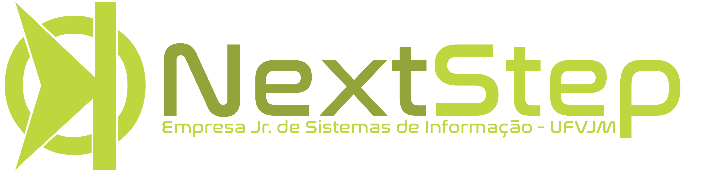

# Treinamento Web Avançado Next Step - 2017/1
> Treinamento de novos membros da empresa Junior Next Step de Sistema de Informação da UFVJM - Diamantina

Neste respositorio esta os codigos utilizado durante as explicações assim como os slides passados durante o treinamento.

## Slides

Slides são as transparencias de apoio ao que é falado dentro do laboratorio de treinamento. 
O conteúdo falado dentro no momento do teinamento vai alem do mostrado nas transparencias, visto que a evolução é feita diante duvidas e perguntas dos participantes.

- Na pasta nomeada de Slides vão ser colocadas as transparencias utilizadas durante o curso. A maioria das informações foram retiradas do [W3School](https://www.w3schools.com), aonde tem uma rica e confiante documentação sobre ferramentas utilizadas na internet.
- Algumas informações são colocadas como experiencias já vividas.
- A reutilização das transparencias são permitidas desde que mencionadas o nome do autor e a Next Step Jr.

## Desafios

Muito do conteúdo ministrado durante o treinamento não é colocado em pratica fora dele. Tendo em vista que os alunos não praticam em casa e o mercado requer pessoa com experiencia e pro-atividade, alguns desafios são feitos em sala.

Durante o treinamento foram passados conceitos de HTML, CSS e JavaScript. Após os conceitos de JavaScript foi introduzido o jQuery, que tem como objetivo facilitar a manipulação de tags HTML e principais recursos JS, como Ajax e outros.

Segue os desafios passados para serem feitos durante o momento do treinamento.

- [OpenWeather](https://openweathermap.org): 
Tendo em vista os conceitos já apresentados até a momento(HTML, CSS, JS/jQuery). Neste desafio é solicitado que maninpule a API e mostre os dados em um formato agradavel(não sendo JSON). Após a leitura deve se contruido uma *view* com HTML e CSS.
- [Facebook](https://developers.facebook.com): API do Facebook trabalha com conceitos diferente da tarefa anterior. Nesta tarefa é pedido que façam uso da primeira Tarefa(Curriculo), e construam a opção de o leitor do site possa efetuar login com Facebook e coletar dados para o Facebook Analytics.

## Tarefas

Para treinar e avaliar os conceitos aprendidos dentro do treinamento ministrado. Após os conceitos ensinados serão cobrados blocos ou conhecimento espeficos sobre os temas. 
Abaixo segue a lista de tarefas e quais conhecimentos serão cobrados.

- Curriculo: Construir um curriculo, utilizar recursos de HTML e CSS. Devem se atentar as novas tag's do HTML5 e os novos recursos do CSS3.
- Redes Sociais: Criar uma aplicação, simbolica, para efetuar login com Facebook, Instagram, Twitter, Google+, GitHub, e crie um perfil para o usuario, atravez de um template.
- NodeJS file changeled: Criar uma aplicação que trate as requisições com as rotas, permita preencher um formulario(Qualquer assunto), e salve em um arquivo.
- ExpressJS: *Comming Soon*
- SQL (Modelagem): *Comming Soon*
- SQL (MySQL): *Comming Soon*
- PHP (Puro, sem framework): *Comming Soon*
- PHP (Framework [Laravel ou Cake]): *Comming Soon*
- Final (Todas ferramentas): *Comming Soon*

## Tools

- [Awsome README](https://github.com/sindresorhus/awesome): Utilizado para construir este README.
- [Google Drive](https://drive.google.com): Utilizado para construir as transparencias
- [Atom](https://atom.io): IDE para desenvolvimento.
- [PHPStorm](https://www.jetbrains.com/phpstorm/): IDE para desenvolvimento.
- [NodeJS](https://nodejs.org/): Construtor de JavaScript Runtime, utilizado para controlar de forma non-blocking I/O, event-drive, além de ser leve e rapido.
- [NPM](https://npmjs.com): Gerenciador de repositorio JavaScript.

## Contribute

- [Luiz Felipe Evaristo](https://github.com/LFelipeEB)

## License

The MIT License (MIT) 

Copyright (c) 2017 

 Permission is hereby granted, free of charge, to any person obtaining a copy of this software and associated documentation files (the "Software"), to deal in the Software without restriction, including without limitation the rights to use, copy, modify, merge, publish, distribute, sublicense, and/or sell copies of the Software, and to permit persons to whom the Software is furnished to do so, subject to the following conditions: 

 The above copyright notice and this permission notice shall be included in all copies or substantial portions of the Software. 

 THE SOFTWARE IS PROVIDED "AS IS", WITHOUT WARRANTY OF ANY KIND, EXPRESS OR IMPLIED, INCLUDING BUT NOT LIMITED TO THE WARRANTIES OF MERCHANTABILITY, FITNESS FOR A PARTICULAR PURPOSE AND NONINFRINGEMENT. IN NO EVENT SHALL THE AUTHORS OR COPYRIGHT HOLDERS BE LIABLE FOR ANY CLAIM, DAMAGES OR OTHER LIABILITY, WHETHER IN AN ACTION OF CONTRACT, TORT OR OTHERWISE, ARISING FROM, OUT OF OR IN CONNECTION WITH THE SOFTWARE OR THE USE OR OTHER DEALINGS IN THE SOFTWARE. 
